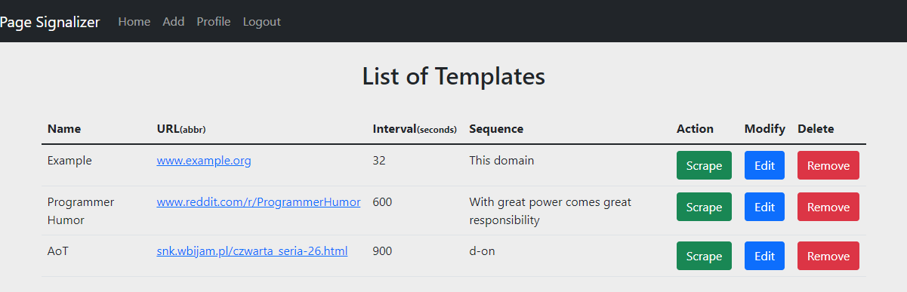

# 1. Page-Signalizer
Tired of manually refreshing the page, in wait for that new video or post? Here comes an easy solution that will notify you as soon as the element of interest is there. 

<h1> How it works? </h1>

User first creates a Connection Template. Then they are able to select it from a table and start scraping. Algorithm scans the target page in defined intervals until sequence in question is found. When search is complete, user is notified about the results.

<h1> Features </h1>
<ol>
<li>Login or Register</li>
<li>See Profile page</li>
<li>See all templates owned by the user</li>
<li>Add/Update/Remove templates</li>
<li>Run Scraping</li>
</ol>

<h1> Tech Stack </h1>
<ul>
<li>Django - Framework</li>
<li>Django-channels - WebSockets</li>
<li>Redis - backing store</li>
<li>Docker - hosting Redis</li>
<li>Beatiful Soup - Extracting data from HTML</li>
<li>Requests - Scraping</li>
</ul>

<h1>Connection Specifications </h1>
<ol>
  <li>url - required  </li>
  <li>seq - required - sequence that the app looks for,  </li>
  <li>mode - optional -  'exists' or 'not_equal' - defines behaviour. Default is 'exists'</li>
  <li>username - optional -  allows logging</li>
  <li>password - optional -  allows logging</li>
  <li>int - optional -  interval in seconds to wait between consecutive connections </li>
  <li>msg - optional -  message to appear in the mbox when element is found</li>
  <li>eta - optional -  Estimated Time of Arrival - adjusts wait interval according to remaining time</li>
  <li>rand - optional - adds random noise to wait intervals. Arg in % e.g. 0.5 means time between connections will vary by 50%</li>
</ol>

<h1>To do</h1>
<ul>
<li>Automate Scraping - process should run in the background and user is to be constantly updated about the progress</li>
<li>auto-redirect after search is complete</li>
</ul>
